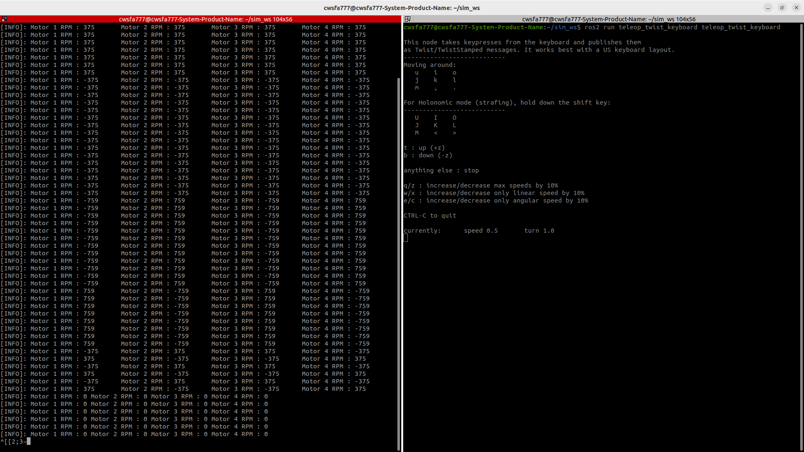

# Four Wheel Drive Kinematic
___ 
This is a simple example that takes the topic of Ros2 /cmd_vel and converts it into the Kinematic angular velocity of a four-wheel drive robot and the RPM of the motor.

Please, see below for more details.

## Installation

```bash
mkdir -p ~/ros2_ws/src
cd ~/ros2_ws/src

git clone https://github.com/dkzpdhtm12/-4_wheel_drive_Kinematic.git
cd ~/ros2_ws

colcon build
```

You can simply installation typing the command

## Run
```bash
ros2 run kinematic kinematic
```
First, you run this program, see only a blank cmd screen. 

This program not print value before cmd_vel input.

```bash
sudo apt-get install ros-$ROS_DISTRO-teleop-twist-keyboard

ros2 run teleop_twist_keyboard teleop_twist_keyboard 
```
teleop 패키지를 활용해서 cmd_vel 토픽을 publish 해보세요. 아래 이미지처럼 출력됩니다.




## Explanation

This program has the following parameter.

## Parameter
#### 𝐿 : Between front wheel and rear wheel distance

#### 𝑊 : Between left wheel and right wheel distance

#### 𝑟 : Wheel radius

#### 𝑣𝑥 : linear.x

#### 𝑣𝑦 : linear.y

#### 𝜔𝑧 : angular.z

## Angular velocity Calculation
The angular velocity of each wheel can be calculated as follows.

### 𝜔𝐹𝐿 = 1 / 𝑟 (𝑣𝑥 − 𝑣𝑦 − 𝜔𝑧 ⋅ (𝐿 + 𝑊) / 2)

### 𝜔𝐹𝑅 = 1 / 𝑟 (𝑣𝑥 + 𝑣𝑦 + 𝜔𝑧 ⋅ (𝐿 + 𝑊) / 2)

### 𝜔𝑅𝐿 = 1 / 𝑟 (𝑣𝑥 + 𝑣𝑦 − 𝜔𝑧 ⋅ (𝐿 + 𝑊) / 2)

### 𝜔𝑅𝑅 = 1 / 𝑟 (𝑣𝑥 − 𝑣𝑦 + 𝜔𝑧 ⋅ (𝐿 + 𝑊) / 2)

## Formula to convert angular velocity to RPM

### RPM = ω × 2π / 60
​
## Problem

1. Since the RPM standard is not set, it may not be suitable for application to actual motor drivers.

2. As a result of analyzing the output RPM, the direction is correct, but it may be inaccurate due to insufficient real-world testing.